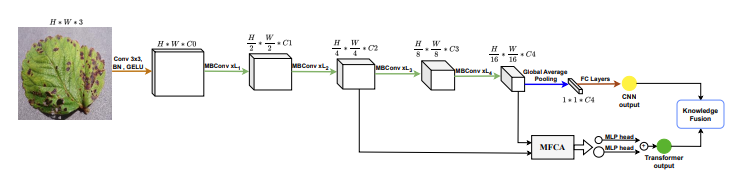

# CTRL-F

🚫 🚧 👷 Under Construction...

CTRL-F: pairing convolution with transformer for image classification via multi-level feature cross-attention and representation learning fusion ([arXiv](https://www.arxiv.org/abs/2407.06673))

